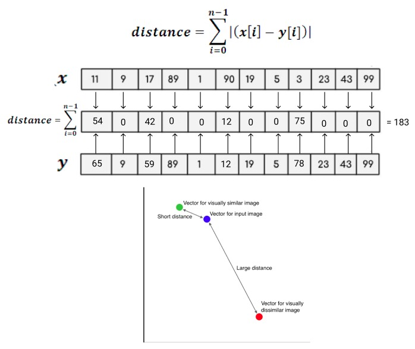

# Face Recognition Process

After going through the Face Detection Process, the array of Face Embeddings should be processed through the whole database, comparing distances between each face and the faces stored in it. At the end, we should get a match for each face detected, even if the match is an "Unknown" face. This is done for the purpose of not getting a wrong match.

### Input

We should receive an array of Embeddings from the Face Detection CNN, which will contain each individual Embedding for each face found in the original input image. Each of these embeddings are going to be of size 128. Then, each of these is going to be treated as a vector of 128 dimensions. As vectors, we can find distances between them. In this implementation, the *L1-Norm* will be used. The L1-Norm is also known as <ins>Manhattan Distance</ins>. By using the embeddings stored in the database for the faces previously stored, we treat each of them as a vector and calculate its Manhattan Distance. An example is shown in the diagram below. For simplicity, we will do the following example with 12 dimensions. 

### Output

As shown in the picture, according to the distance calculated between the two vectors, we can judge if they are similar enough to be labeled the same. If they are, we put the label into the original input image and can consider it matched to a face, therefore successfully completing the Face Recognition Process. If the Face Embedding is not similar to any of the pictures stored in the database, we could match it to an Unknown image, preventing an incorrect output, but we could not consider it was a successfull Face Recognition, as don't have a label other than "Unknown" for the original input image's face. If we had more than one face in the picture, this process repeats for each of them.
