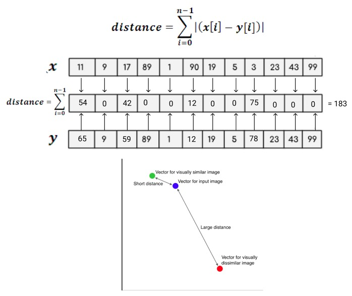

#Face Recognition Process

After going through the Face Detection Process, the array of Face Embeddings should be processed through the whole database, comparing distances between each face and the faces stored in it. At the end, we should get a match for each face detected, even if the match is an "Unknown" face. This is done for the purpose of not getting a wrong match.

###Input

We should receive an array of Embeddings from the Face Detection CNN, which will contain each individual Embedding for each face found in the original input image. Each of these embeddings are going to be of size 128. Then, each of these is going to be treated as a vector of 128 dimensions. For simplicity, we will do the following example with 12 dimensions. As vectors, we can find distances between them. In this implementation, the *L1-Norm* will be used, also known as the <ins>Manhattan Distance</ins>

