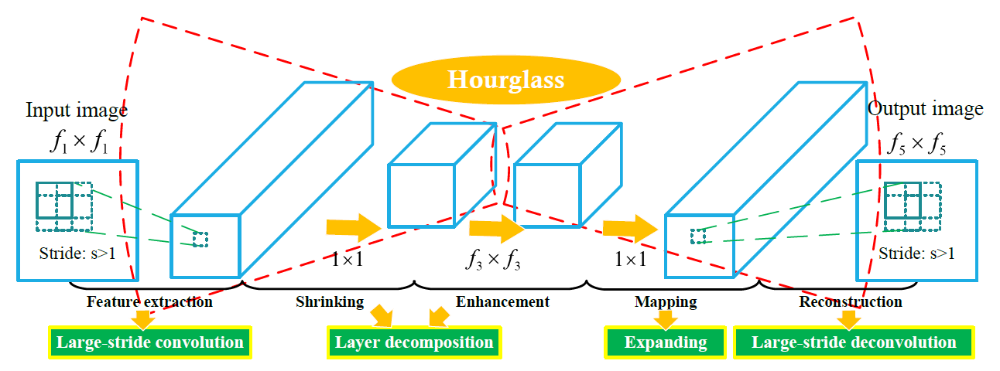
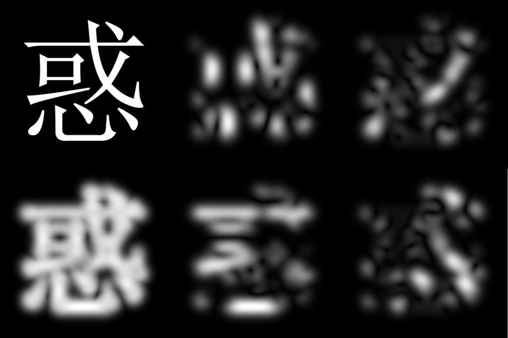

# Popular Architectures of Face Recognition CNN's

## Embeddings and Compression

**Compression:**

Traditionally, *compression* is a process through which the space required to store files is reduced. Then through decompression, the original files should be recovered completely. We call this ability to be recovered completrly as fidelity, and it basically describes how much of the original file we can recover given the compressed file.

Many times findin the best or optimal compression might be complicated, so the space optimizations are limited. However, with the use of neural networks we can achive significant file compressions with some level of fidelity. This is achieved using an hourglass architecture that is trained together. The the left end of the NN is used as the compressor, and the right part of the NN is used as the decompressor. 

**Embeddings:**

*Embedding* is a technique used in ML to map categorical or high-dimensional data to a low-dimensional space. Ideally, each point in the original dataset corresponds to exactly one point in the embedded dataset; however, this is not always the case as embedding is many times used for compression, meaning that the original space is much larger than the embedded one.

One of the key ideas of embedding is that data that is similar in the original dataset should be embedded to nearby points. In other words, the distance between two points in an embedding is proportional to how similar the original data points were.

As an embedding can be seen as a function that takes an n-dimensional vector and outputs *k* values, it is simple to realize that an appropriate embedding for a dataset can be found using a CNN. The input layer would represent the original high-dimensional data and the output layer would represent the embedding itself.

## Gabor Filter

A *Gabor Filter* is a filter used for texture analysis. It scans the frequency content of an image in a specific direction. This filter is popular because many experts believe that it works in a similar way to human vision, meaning that image analysisi with this filter should be similar to the perceptions humans have.

By using Gabor filters to simplify images by amplyfing or isolating its key features, CNN can focus only on this important aspects, allowing for more transparent and less noisy neural nets. This works by using the Garbor filter to get different features of an image, each in a different subimage. Each of this subimages can then be processed by a different CNN and then the results of all of this can be combined using a *generalizer*. This shows to consistantly have better results than just processing the whole image or its compression through a neural net.

## Triplet Loss

*Triplet Loss* is a loss function used to train a CNN based on the proximity datapoints should have instead of the expected output of the neural net. This loss function is calculated by taking three samples from the training dataset. One is called the *anchor* and is used as the base sample, the remaining two are called *positive* and *negative*. The positive sample should be similar to the anchor, while the negative should be different. Then, the neural net will try to minimize the distance between the anchor and the positive and maximize the distance between the anchor and the negative. After training this should result in a CNN that maps input to a point in an embedding, and we can tell how similar two inputs are by the distance between their embeddings.

## Sources:
- Computerphile, "How Face ID Works... Probably" : https://www.youtube.com/watch?v=mwTaISbA87A
- Bogdan Kwolek, "Face Detection Using Convolutional Neural Networks and Gabor Filters" 
- Jie Wang and Zihao Li, "Research on Face Recognition Based on CNN"
